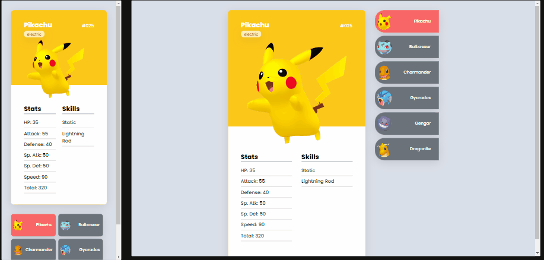

# Pokedéx
Estrutura do Projeto de Pokedéx com Javascript do curso DevQuest.

## Table of contents

  - [The challenge](#the-challenge)
  - [gif](#gif)
  - [Built with](#built-with)
  - [What I learned](#what-i-learned)

### The challenge

Users should be able to:

- View the optimal layout for the page depending on their device's screen size
- See hover states for all interactive elements on the page
- Click on the list and see the card of the respective pokémon, so as the color change on the highlighted item on the right.

### Gif

# Click the icon at the top right corner of the gif to check the project's github page

### Built with

- Semantic HTML5 markup
- CSS custom properties
- Flexbox
- Javascript

### What I learned

Building this project I get to exercise and get more in touch with some of the important concepts of Javascript, such like variables, functions, events and DOM.